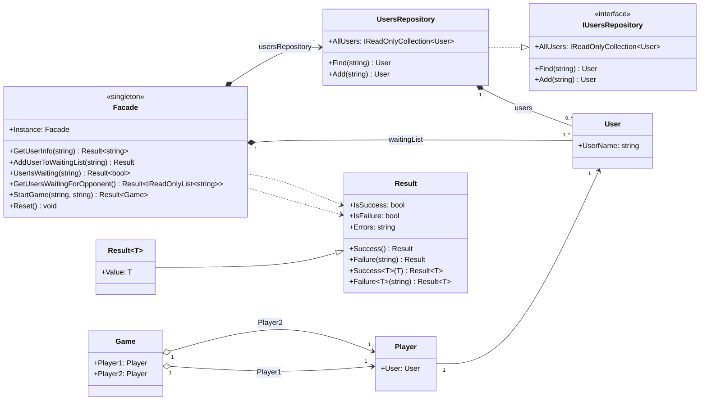

# Consigna proyecto 2026 2º semestre: diagrama de clases <!-- omit in toc -->

<!-- markdownlint-disable-next-line MD033 -->

<!-- markdownlint-disable-next-line MD025 -->
# Diagrama de clases

```mermaid
classDiagram
    direction LR

    class User {
        +UserName: string
    }

    class Player {
        +User: User
    }

    class Game {
        +Player1: Player
        +Player2: Player
    }

    class IUsersRepository {
        <<interface>>
        +AllUsers: IReadOnlyCollection~User~
        +Find(string) User
        +Add(string) User
    }

    class UsersRepository {
        +AllUsers: IReadOnlyCollection~User~
        +Find(string) User
        +Add(string) User
    }

    class Result {
        +IsSuccess: bool
        +IsFailure: bool
        +Errors: string
        +Success() Result
        +Failure(string) Result
        +Success~T~(T) Result~T~
        +Failure~T~(string) Result~T~

    }

    class Result_T_ ["Result&lt;T&gt;"] {
        +Value: T

    }

    class Facade {
        <<singleton>>
        +Instance: Facade
        +GetUserInfo(string) Result~string~
        +AddUserToWaitingList(string) Result
        +UserIsWaiting(string) Result~bool~
        +GetUsersWaitingForOpponent() Result~IReadOnlyList~string~~
        +StartGame(string, string) Result~Game~
        +Reset() void
    }

    %% Relaciones básicas

    Result_T_ --|> Result
    Facade ..> Result~T~
    Facade ..> Result

    Game "1" o--> "1" Player : Player1
    Game "1" o--> "1" Player : Player2

    Player "1" --> "1" User

    UsersRepository ..|> IUsersRepository

    Facade "1" *--> "1" UsersRepository : usersRepository

    %% Composiciones vía colecciones internas

    Facade "1" *-- "0..*" User : waitingList
    UsersRepository "1" *-- "0..*" User : users
```
