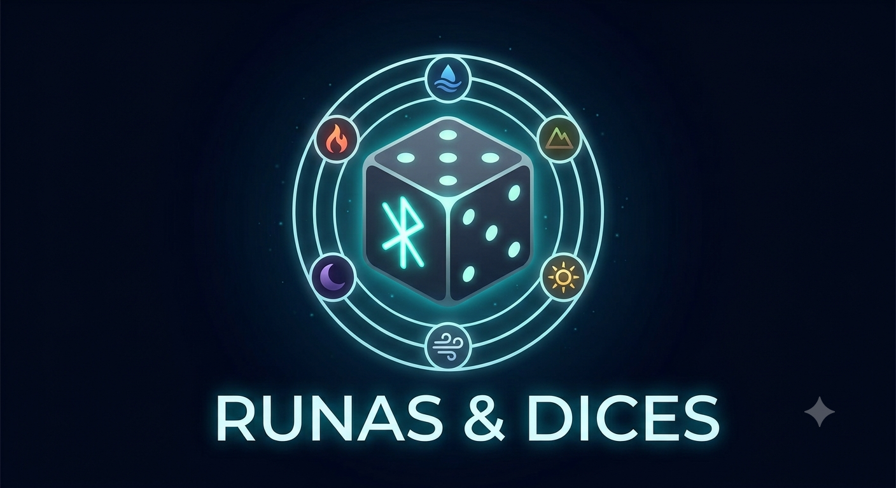

<!-- markdownlint-disable-next-line MD033 MD041 -->

# Universidad Católica del Uruguay

## Facultad de Ingeniería y Tecnologías

### Programación II

# Consigna proyecto 2026 2º semestre

<!-- markdownlint-disable-next-line MD033 -->

Este documento describe el proyecto del curso de **Programación II** del segundo
semestre de 2026.

El proyecto consistirá en implementar un bot de [Discord](https://discord.com)
para jugar un juego de cartas y dados llamado **Runas & Dices**.

Además de la consigna en este documento, lee estos otros, que también son parte
de la consigna:

| Documento                  | Contenido                                |
| -------------------------- | ---------------------------------------- |
| [GAME.MD](./GAME.md)       | Descripción y reglas del juego           |
| [STORIES.md](./STORIES.md) | Funcionalidad del bot                    |
| [BOT.md](./BOT.md)         | Cómo crear el bot de Telegram            |
| [SEED.md](./SEED.md)       | Código provisto como punto de partida    |
| [DIAGRAM.md](./DIAGRAM.md) | Diagrama de clases de dominio provistas |

> [!TIP]
> No te preocupes si no entiendes algo de lo que está en este repositorio la
> primera vez lo que leas. Incluye algunas cosas que iremos viendo durante el
> curso y que los profesores te iremos explicando a medida que sea necesario.

Este repositorio, y en particular este documento, va a ir cambiando a medida que
progrese el curso: vamos a ir agregando información adicional sobre las
sucesivas entregas, incluyendo fechas, rúbricas, etc.

> [!IMPORTANT]
> Vas a tener que crear el repositorio para tu proyecto mediante un *fork* de
> este repositorio. Luego deberás configurar tu repositorio para poder
> sincronizar cambios con este. No lo hagas hasta que te enseñemos a hacerlo.

Para facilitar tu trabajo, no modifiques este archivo de aquí para arriba.

⬆︎ No modifiques de aquí para arriba

------------

⬇︎ Haz tus modificaciones de aquí en adelante
