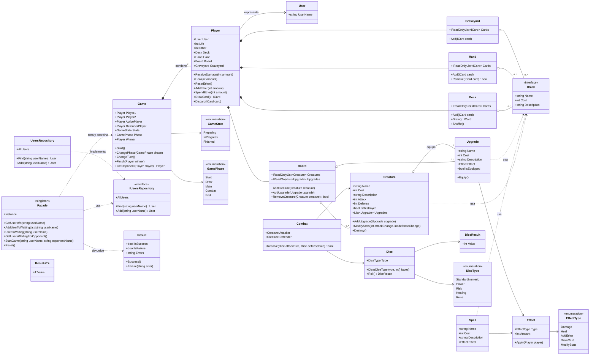

# Modelo de dominio - primera entrega

Este es el modelo simplificado que se utilizará para la primera entrega.
Incluye 20 tipos principales, no utiliza herencia entre las clases del juego y
usa una única interfaz, `ICard`, para expresar los datos comunes de las cartas.

`GameState`, `GamePhase`, `DiceType` y `EffectType` son enumeraciones de apoyo;
no se consideran clases del modelo.

## Diagrama de clases

## Lista de clases y responsabilidades

| Clase | Responsabilidad | Colabora con |
| --- | --- | --- |
| `User` | Identificar al usuario de la aplicación. | `UsersRepository`, `Player` |
| `Player` | Administrar vida, Ether y zonas propias. | `User`, `Game`, `Deck`, `Hand`, `Board`, `Graveyard` |
| `Game` | Controlar jugadores, turnos, fases, estado y ganador. | `Player`, `Combat` |
| `IUsersRepository` | Definir cómo buscar y agregar usuarios. | `Facade`, `UsersRepository` |
| `UsersRepository` | Guardar y buscar usuarios. | `User` |
| `Facade` | Recibir solicitudes externas y coordinar casos de uso. | `UsersRepository`, `Game`, `Result` |
| `Result` | Informar éxito o error de una operación. | `Facade` |
| `Result<T>` | Devolver un resultado junto con un valor. | `Facade` |
| `ICard` | Definir nombre, costo y descripción comunes de una carta. | `Creature`, `Spell`, `Upgrade`, zonas |
| `Creature` | Mantener ataque, defensa, mejoras y estado de destrucción. | `Upgrade`, `Board`, `Combat` |
| `Spell` | Representar una carta que posee un efecto. | `Effect`, `Player` |
| `Upgrade` | Representar una mejora equipable. | `Creature`, `Board`, `Effect` |
| `Deck` | Agregar, barajar y robar cartas. | `Player`, `ICard` |
| `Hand` | Mantener las cartas que el jugador puede jugar. | `Player`, `ICard` |
| `Board` | Mantener criaturas y mejoras activas. | `Player`, `Creature`, `Upgrade` |
| `Graveyard` | Conservar cartas descartadas o destruidas. | `Player`, `ICard` |
| `Dice` | Lanzar un dado según un tipo y sus caras. | `DiceResult`, `Combat` |
| `DiceResult` | Representar el valor obtenido al lanzar un dado. | `Dice`, `Combat` |
| `Effect` | Aplicar daño, curación, Ether u otro efecto básico. | `Player`, `Spell`, `Upgrade` |
| `Combat` | Comparar ataque y defensa y marcar una criatura destruida. | `Creature`, `Dice` |

## Decisiones sobre SRP y Expert

- `Player` modifica su vida y Ether porque es quien posee esos datos.
- `Deck`, `Hand`, `Board` y `Graveyard` administran exclusivamente sus propias
  colecciones.
- `Creature` conoce sus estadísticas y sus mejoras.
- `Combat` coordina una operación que necesita información de dos criaturas y
  de dos dados.
- `Game` controla el estado de la partida, pero no administra internamente las
  cartas ni calcula los dados.
- `Facade` comunica el exterior con el dominio, pero no contiene las reglas del
  combate.
- `ICard` evita repetir el contrato común de las cartas sin crear una clase
  abstracta ni una jerarquía de herencia.

## Nota sobre el código provisto

`Result<T>` ya viene implementado en la semilla heredando de `Result`. Esa
relación pertenece al código entregado por la universidad. En las nuevas
clases del juego no se agrega ninguna jerarquía de herencia: las cartas usan la
interfaz `ICard`.
